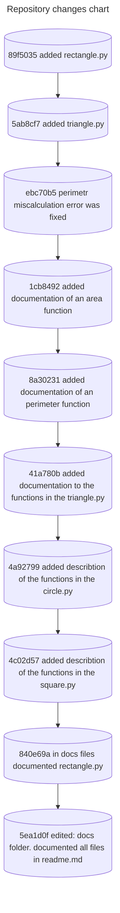

```mermaid
---
title: Repository changes chart
---
flowchart TD
    id1[(89f5035 added rectangle.py)] --> id2[(5ab8cf7 added triangle.py)] --> id3[(ebc70b5 perimetr miscalculation error was fixed)] --> id4[(1cb8492 added documentation of an area function)] --> id5[(8a30231 added documentation of an perimeter function)] --> id6[(41a780b added documentation to the functions in the triangle.py)] --> id7[(4a92799 added describtion of the functions in the circle.py)] --> id8[(4c02d57 added describtion of the functions in the square.py)] --> id9[(840e69a in docs files documented rectangle.py)] --> id10[(5ea1d0f edited: docs folder. documented all files in readme.md)]
```